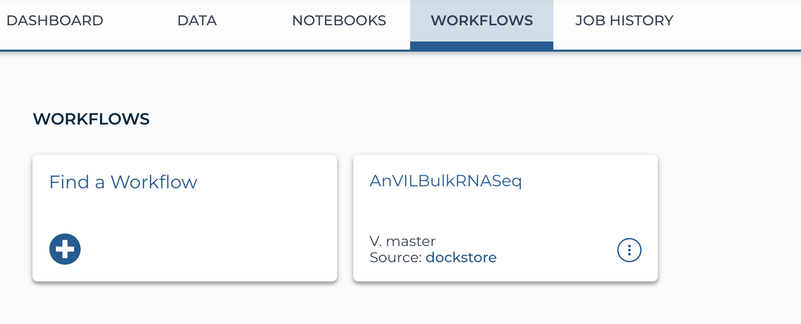
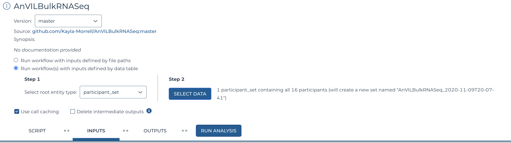
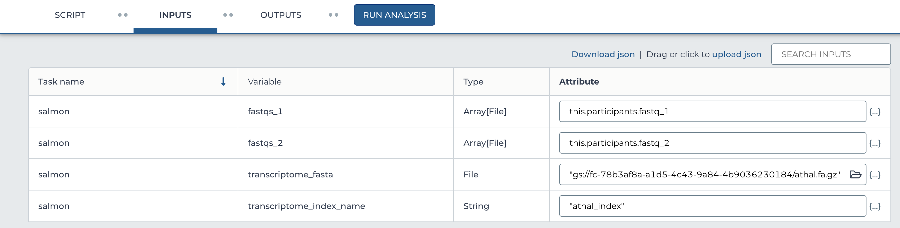

```{r, include = FALSE}
knitr::opts_chunk$set(
  collapse = TRUE,
  comment = "#>"
)
```

# Introduction

This vignette will walk you through running the workflow on AnVIL. The data used
for this workflow would have been organized using the previous vignette
[Organizing Data for AnVIL Workflow](B_OrganizingData.html). 

# Installation

The vignette [An Overview of AnVILBulkRNASeq](A_Overview.html) demonstrates how
to install the `AnVILBulkRNASeq` package. Refer to that vignette for
installation steps. The following command will load the package.

```{r setup}
library(AnVILBulkRNASeq)
```

# Locating the workflow

AnVIL will play an important role in this vignette. It's crucial to be able to
log into [AnVIL](https://anvil.terra.bio/#). Once logged in click on the three
horizontal lines in the upper left hand corner and click on `Workspaces`. This
will list all the workspaces you have access too. 


We will be working on the workspace entitled `Bioconductor-Workflow-DESeq2`. In
this workspace you will see the `Workflows` tab. This is where all the workflows
are located for this workspace. 

# Running the AnVILBulkRNASeq workflow

## Selecting the data

Clicking on the `AnVILBulkRNASeq` workflow link will bring you to the set up of
the workflow. 



`Version` should be set to `master`, the button for 'Run
workflow(s) with inputs defined by data table' should be selected. This means
that the data will be coming from a table in the `Data` tab. The `Data` tab
contains the table of the metadata that we uploaded in the [Organizing Data for
AnVIL Workflow](B_OrganizingData.html) vignette. 

Step 1 - select `participant_set`.

Step 2 - click `Select Data`. This will open a new window. Click the first
option 'Create a new set from all 16 participants', then `Ok`.



## Selecting the inputs

Under `Inputs` there will be a table with `Task name`, `Variable`, `Type`, and
`Attribute` as columns. The only column we need to worry about is the
`Attribute` column. This is where you fill in where the data is located for each
input. The `Type` column will tell you what type of input the workflow is
looking for, this is defined in the actual workflow script so you won't need to
change this at all. It's helpful to know when assigning the attributes what type
the workflow is expecting because it won't run without the proper input type.

For the variable `fastqs_1` the workflow is looking for an `Array[File]`. We
will provide it with a column from the data table that contains the links for
all of the `fastq_1` files for our example dataset. We fill in this attribute as
`this.participants.fastq_1`. This command is telling the workflow look in `this`
input (which is the `participant_set`) for the `participants` which corresponds
to the `participants` table. In that `participants` table look for the `fastq_1`
column. That will be the input for this variable.

The same is for `fastqs_2` attribute `this.participants.fastq_2`, except for
`fastq_1` column it's looking at the `fastq_2` column.

The `transcriptome_fasta` variable is expecting a `File` type attribute. We
provide the link to where the transcriptome fasta is on the Google bucket:
`"gs://fc-78b3af8a-a1d5-4c43-9a84-4b9036230184/athal.fa.gz"`. Then the
`transcriptome_index_name` is looking for a `String` type. This is the name of
the index that will part of the result of the Salmon workflow. We provide it
with `athal_index`.



## Saving and running the workflow

Now that all the variables are defined, click the `Save` button at the upper
right hand corner of the inputs table. Once the inputs are saved, you can click
`Run Analysis`. This will run the workflow script that is shown in the
`Script` tab.

# Checking the progress

The `Job History` tab at the top of the workspace will show all of the jobs /
workflows that have been submitted. Along with other information, the job
history will tell you if the workflow was a sucess or not. By clicking on the
submission in question, you will be able to get more information. This may help
you debug if there was something wrong with the workflow.

# Next steps

Now that we have run the workflow and it's been a success (or so we hope) we can
begin looking at the output. The quantified output data from the Salmon workflow
will be what is used in the DESeq2 analysis.

# Session Information

```{r, eval = TRUE}
sessionInfo()
```
